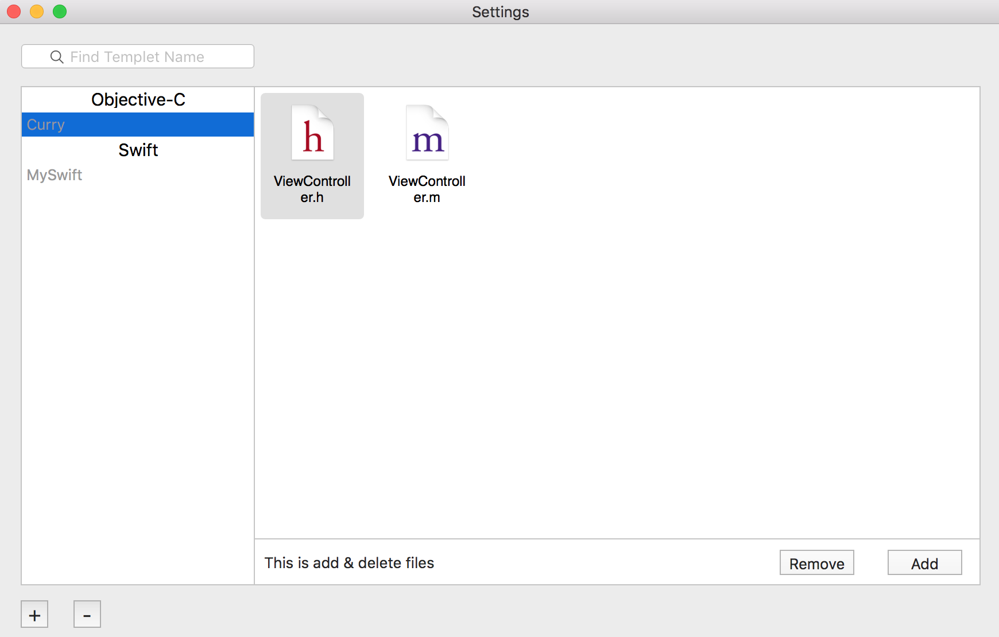
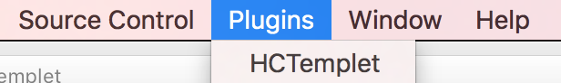
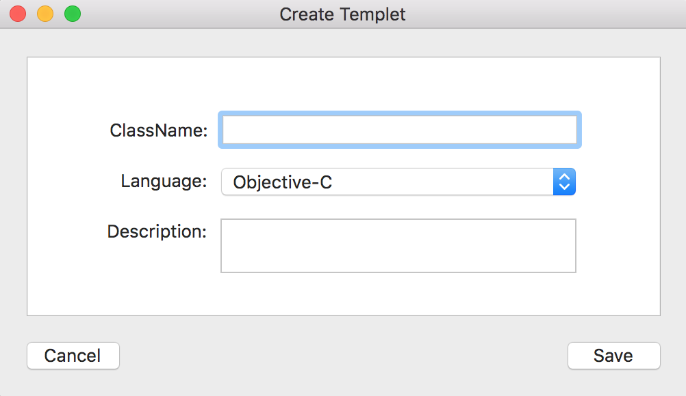
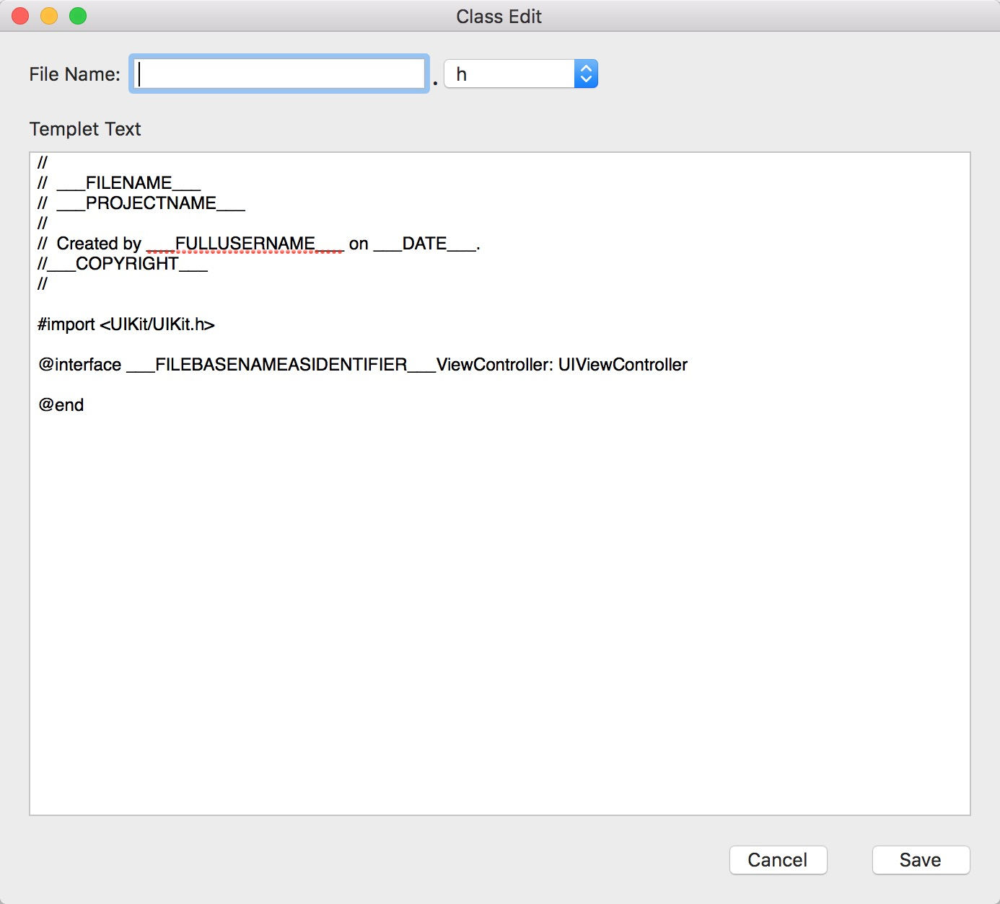

## HCTemplet

## What is this?

HCTemplet是一个用于在Xcode自定义类格式薄板的插件，支持oc和swift

## How to install it?

推荐使用[Alcatraz](https://github.com/alcatraz/Alcatraz)。

你也可以clone整个工程，然后编译，插件会自动安装到~/Library/Application Support/Developer/Shared/Xcode/Plug-ins这个目录上。

一定要选Load Bundle，Skip的话，插件是无法生效的。

## How to use it?

点击Xcode的Plugins菜单，打开HCTemplet选项进行编辑和配置。

## Setting
打开设置面板点击 **+**、**—** 选择创建模板名称和类型

建立模板后要添加删除自定义文件

## License

MIT.